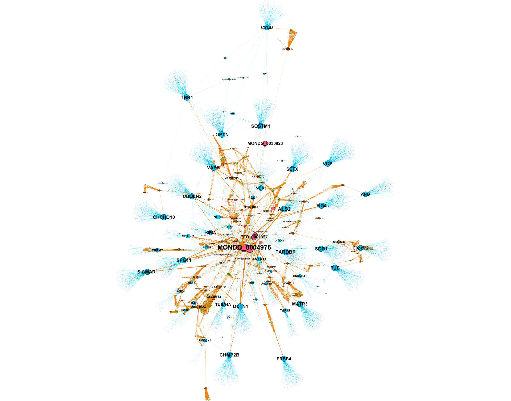

# ALS Genetic Mechanism Explorer



A data pipeline that builds a reproducible evidence graph for amyotrophic lateral
sclerosis (ALS). It takes a 46-gene ALS panel, pulls the public evidence around the genes
from six databases, links the records into one graph, scores the genes, and writes
citation-backed research hypotheses. A row in the output traces back to a cached API
response, so a clean re-run reproduces the database.

The image above is the gene interaction network: rust nodes are the 46 panel genes, the
faint nodes are their STRING partners, and the lines are STRING interactions. It is
rendered by `render_graph.py` from the live-built database, using a ForceAtlas2 layout with
nodes sized by betweenness centrality, so the bridge genes read largest.

Genes also carry an ALS sensitivity and specificity note: the published share of
familial and sporadic ALS and the phenotype specificity, from GeneReviews (NBK1450, Tables
2a and 2b) where available, with cited PubMed sources for genes outside those tables. The
data sits in `data/als_gene_evidence.json`. Formal sensitivity and specificity are not
reported per ALS gene; these are the field's closest published measures.

This is research tooling. The hypotheses are machine-generated leads, not validated
biology and not medical advice.

## The gene panel

The panel has 46 genes from two sources:

1. The 41 human proteins that carry UniProt keyword
   [KW-0036](https://www.uniprot.org/keywords/KW-0036) (Amyotrophic lateral sclerosis),
   downloaded from the UniProt REST API into `data/raw/uniprot_als_kw0036.fasta`:

   ```
   https://rest.uniprot.org/uniprotkb/stream?format=fasta&includeIsoform=true&query=((keyword:KW-0036))
   ```

2. And 5 more ALS genes from the OMIM ALS phenotypic series PS105400 that UniProt does not
   keyword-tag: **CFAP410, MOBP, SCFD1, TAF15, UNC13A**. OMIM blocks automated access, so this
   set was sourced from the GeneReviews ALS Overview ([NBK1450](https://www.ncbi.nlm.nih.gov/books/NBK1450/)).
   The five were verified as reviewed human proteins in UniProt before they were added.

The 46 symbols:

```
ALS2  ANG  ANXA11  ATXN2  C9orf72  CCNF  CFAP410  CHCHD10  CHMP2B  CYLD  DAO  DCTN1  ELP3
ERBB4  FGGY  FIG4  FUS  HNRNPA1  KIF5A  LRP12  MATR3  MOBP  NEFH  NEK1  OPTN  PFN1  PRPH
SCFD1  SETX  SIGMAR1  SOD1  SPG11  SPTLC1  SQSTM1  TAF15  TARDBP  TBK1  TIA1  TMEM106B
TRPM7  TUBA4A  UBQLN2  UBQLN4  UNC13A  VAPB  VCP
```

## Data sources

Public APIs, queried live and cached for reproducibility. No paid keys are required.

| Source | Used for | Endpoint |
|---|---|---|
| UniProt | protein accession, name | rest.uniprot.org |
| STRING | protein interaction partners and confidence | string-db.org/api |
| NCBI ClinVar | classified variants (germline classification) | eutils.ncbi.nlm.nih.gov |
| NCBI PubMed | literature and citations | eutils.ncbi.nlm.nih.gov |
| Reactome | pathway membership | reactome.org/ContentService |
| Open Targets | ALS disease association and known drugs | api.platform.opentargets.org |

Rate limiting: with `NCBI_API_KEY` set the NCBI clients run at up to 10 requests per
second; without it they stay under 3 and back off on errors. The clients retry transient
failures with exponential backoff and write the raw response to disk.

## How it works

1. **Resolve.** For a gene symbol, UniProt returns the reviewed human protein and its accession.
2. **Fetch.** STRING returns interaction partners, ClinVar returns classified variants,
   Reactome returns pathway membership, Open Targets returns the ALS association score and
   known drugs, and PubMed returns the literature.
3. **Cache.** The raw response for a request is written under `data/raw/cache`, keyed by a
   hash of source, endpoint, and parameters.
4. **Normalize.** `src/db/populate.py` reads the response fields and writes them into a DuckDB schema.
5. **Build.** `src/graph/build_graph.py` assembles a graph, `src/scoring` ranks genes and
   pathways, and `src/hypotheses/generator.py` writes the hypotheses.
6. **Export.** The run writes the ranked tables, the hypotheses, and a GraphML file to `outputs/`.

The runner is `src/pipeline/run_all.py`.

## Database schema

DuckDB tables (see `src/db/schema.py`):

```
genes(ensembl_id, gene_symbol, uniprot_id, protein_description)
variants(variant_id, gene_symbol, clinical_significance, disease_name)
interactions(gene_a, gene_b, confidence_score)
pathways(pathway_id, pathway_name)
gene_pathways(gene_symbol, pathway_id)
disease_associations(gene_symbol, disease_id, disease_name, score)
drugs(drug_id, name, mechanism_of_action, max_clinical_phase)
gene_drugs(gene_symbol, drug_id)
papers(pmid, doi, title, abstract, pub_date, ingestion_reason)
claims(claim_id, paper_id, subject, predicate, object, evidence_level)
hypotheses(hypothesis_id, title, description, confidence, hypothesis_type)
hypothesis_evidence(hypothesis_id, pmid, claim_id, relationship_type)
ingestion_log(source_name, query_params, status, record_count, cache_path, error_message, created_at)
```

`paper_id = 'not_found'` is a join guard for structural claims that carry no inline PMID. It
does not back a cited hypothesis: the scoring and hypothesis code filters it out.

## Gene scoring

`src/scoring/gene_score.py` blends several signals into one rank, with weights from
`config.yaml`: Open Targets association (0.25), ClinVar pathogenicity (0.20), pathway
centrality (0.15), STRING centrality (0.15), literature volume (0.15), citation quality
(0.10), and druggability (0.10), less a contradiction penalty (0.05). The weighted signals
fall on a 0 to 1 scale.

## Hypotheses

`src/hypotheses/generator.py` walks the graph and writes a hypothesis per pattern it finds:

- **Shared pathway convergence:** two panel genes sit in the same Reactome pathway.
- **Network proximity:** two proteins partner in STRING above the confidence threshold, or
  a non-panel gene partners with two or more panel genes.
- **Variant and pathway convergence:** a gene with pathogenic ClinVar variants shares a
  pathway with a panel gene.

A hypothesis cites the literature claims that mention its genes. Confidence drops to Low
when a hypothesis rests on fewer than two papers, when the supporting papers used animal
models with no human data, or when the records disagree.

## Results from the current run

| Metric | Count |
|---|---|
| Genes (real UniProt accessions) | 46 |
| STRING interactions (confidence >= 0.7) | 405 |
| ClinVar variants | 2,424 |
| Reactome pathways (distinct R-HSA) | 163 |
| Open Targets ALS associations | 92 |
| Drugs (real ChEMBL ids) | 110 |
| Papers | 362 |
| Distinct PMIDs cited across hypotheses | 244 |
| Hypotheses | 589 |

## Outputs

- `outputs/ranked_genes.csv` ranked genes with the score components.
- `outputs/ranked_pathways.csv` ranked pathways with score.
- `outputs/hypotheses.md` the hypotheses in long form with citations.
- `outputs/als_knowledge_graph.graphml` the graph for Cytoscape or Gephi.
- `outputs/graph_overview.png` the rendered gene interaction network (shown at the top).
- `outputs/REAL_DATA_PROVENANCE.md` per-source counts and five spot-checked records with source URLs.
- `outputs/LEAD_HYPOTHESIS_BRIEF.md` an analyst write-up of one lead.

## Run it

Set up a virtual environment and install the dependencies:

```
python3 -m venv .venv && source .venv/bin/activate
pip install -r requirements.txt
```

Rebuild the database from the cached responses, with no network:

```
# in config.yaml set: api_settings.offline_mode: true
python3 -m src.pipeline.run_all --config config.yaml
```

Run live against the public APIs by setting `offline_mode: false`. New responses get cached,
so the second run is fast. Re-render the graph image with `python3 render_graph.py`.

## Verify it

`gate_check.py` runs the verification queries against the DuckDB:

```
python3 gate_check.py
```

It confirms the floors: 46 genes with UniProt accessions, 100 or more STRING edges above the
threshold, 50 or more ClinVar variants across 8 or more genes, 15 or more distinct Reactome
pathways, a real Open Targets ALS association, 3 or more drugs with ChEMBL ids, 100 or more
papers with 50 or more distinct resolvable PMIDs, and hypotheses that cite 20 or more distinct
PMIDs. `validate_duckdb.py`, `verify_graphml_empirical.py`, and `verify_hypotheses_empirical.py`
check the database, the graph, and the hypotheses against the source data.

## Reproducibility and provenance

`data/raw/cache` holds the raw API responses. A database row derives from a cached response,
so a reviewer can trace a gene, variant, interaction, pathway, drug, or paper back to its
source. Wiping the cache and re-running against the live APIs rebuilds the database to the
same shape, which shows the records were not seeded by hand.
`outputs/REAL_DATA_PROVENANCE.md` lists per-source counts and spot-checks five records
against their source URLs.

## Tests

The suite under `tests/` runs offline with mocked endpoints. See `TEST_INFRA.md` for the
layout.

```
PYTHONPATH=. pytest -q
```

## Repository layout

```
src/ingest/      API clients, disk cache, paper deduplication
src/db/          DuckDB schema and field normalization
src/graph/       graph build and GraphML export
src/scoring/     gene and pathway ranking
src/hypotheses/  rule-based hypothesis generation
src/pipeline/    end-to-end runner
render_graph.py  renders outputs/graph_overview.png from the database
data/raw/        the UniProt FASTA and cached API responses
data/processed/  the built DuckDB and the deduplicated papers
data/als_gene_evidence.json  per-gene familial/sporadic ALS share and specificity (GeneReviews + cited PubMed)
outputs/         ranked tables, hypotheses, graph, graph image, provenance
tests/           offline test suite
gate_check.py    verification-gate queries
```
